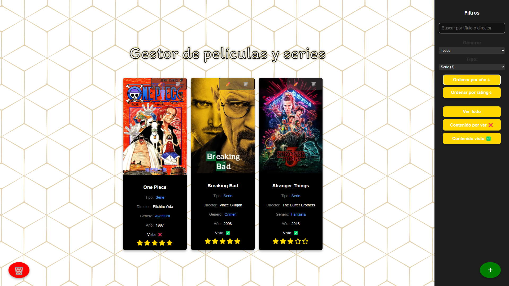
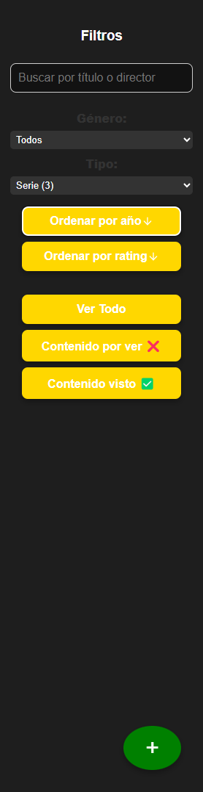
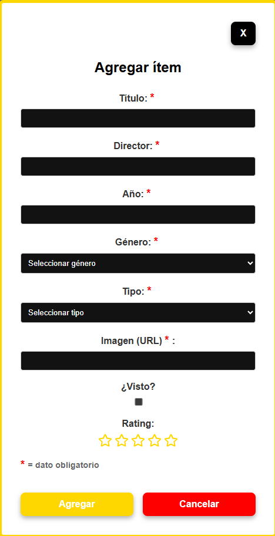
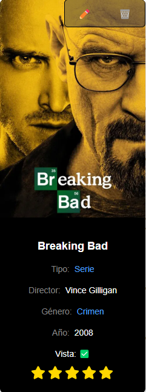

# Gestor de Películas y Series

**Integrantes del grupo**:

- **Federico Uñates** (FAI-4988)
- **Emanuel Pinedo** (FAI-4871)
- **Rodrigo Martinez** (FAI-4318)

---

## 1. Descripción de la Aplicación

El **Gestor de Películas y Series** es una aplicación web que permite:

- Registrar y almacenar datos de películas y series (título, director, año, género, rating, tipo e imagen).
- Filtrar el contenido según estado de visualización (visto, por ver o todo), género, tipo y búsqueda por título o director.
- Ordenar la lista por año o rating (ascendente/descendente).
- Editar y eliminar registros existentes.
- Persistir datos en el `localStorage` para conservar el estado al recargar la página.

---

## 2. Estructura y Función de Archivos Iniciales

| Archivo          | Función                                                                                                                                         |
| ---------------- | ----------------------------------------------------------------------------------------------------------------------------------------------- |
| **main.jsx**     | Punto de entrada de la aplicación. Renderiza el componente raíz (`App`) dentro del nodo `#root`. Utiliza `ReactDOM.createRoot` y `StrictMode`.  |
| **App.jsx**      | Contiene el componente principal que integra la página `Home`. Aplica estilos globales y envuelve toda la interfaz.                             |
| **index.css**    | Hoja de estilos globales. Define tipografía, colores base, estilos de botones y preferencias de color (modo claro/oscuro).                      |
| **package.json** | (o `package-json.js`) Archivo de configuración del proyecto. Lista dependencias, scripts de desarrollo (`npm run dev`), construcción y pruebas. |

---

## 3. Instalación y Uso

Sigue estos pasos para clonar, instalar dependencias y ejecutar la aplicación en tu entorno local:

1. **Clonar el repositorio**

   ```bash
   git clone https://github.com/tu-usuario/gestor-peliculas-series.git
   cd gestor-peliculas-series
   ```

2. **Instalar dependencias**

   ```bash
   npm install
   ```

3. **Ejecutar en modo desarrollo**

   ```bash
   npm run dev
   ```

4. **Abrir en el navegador**\
   Navega a `http://localhost:5173` (o el puerto que indique la consola).

5. **Construir para producción**

   ```bash
   npm run build
   ```

---

## 4. Capturas de Pantalla

| Inicio                                               |
| ---------------------------------------------------- |
|  |

| Filtros y Búsqueda                         |
| ------------------------------------------ |
|  |

| Formulario de Agregado/Edición             |
| ------------------------------------------ |
|  |

| Vista de Cartas                      |
| ------------------------------------ |
|  |

---

## 5. Tecnologías y Herramientas

- ⚛️ **React 18** (funcional components, hooks)
- 🎨 **CSS Modules** para estilos encapsulados
- 📦 **Vite** como bundler y servidor de desarrollo
- 🌐 **localStorage** para persistencia de datos
- 📑 **Lucide React** y **React Icons** para iconos

---
